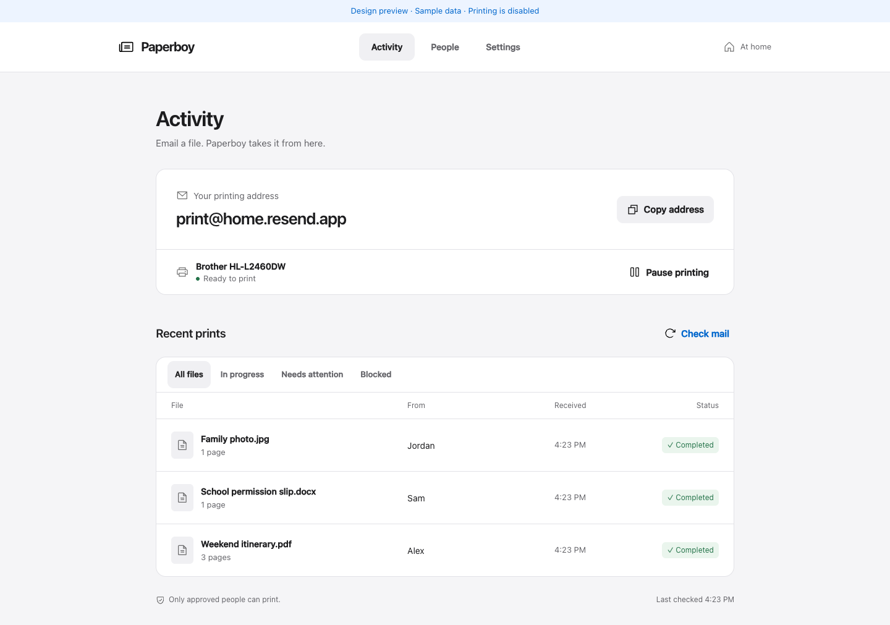

# Paperboy

Email a file. Find it on your home printer.

Paperboy is a small, self-hosted app for family printing. Connect Resend, choose a local
printer, and approve the people who can print. Their email attachments enter a persistent
queue and print automatically. Everyone else is blocked before attachments are downloaded.
The service and conversion tools run as native Rust binaries.



## Start

Requires Docker with Compose 2.24.4 or newer, curl, internet access, a Resend account, and a local AirPrint or IPP printer.

```sh
mkdir paperboy && cd paperboy
curl -fL https://github.com/thekozugroup/Paperboy/releases/latest/download/install.sh -o install.sh
sh install.sh
docker compose -f compose.release.yaml --profile updates up -d
docker compose -f compose.release.yaml logs paperboy
```

Open **[localhost:8025](http://localhost:8025)**. Enter the setup code shown in the Docker logs,
choose an owner password, and follow the three setup steps:

1. **Email:** supply a Resend API key with full access and your receiving address.
2. **Printer:** discover a local printer or enter its IPP address.
3. **People:** add the exact email addresses allowed to print, including your own.

Then email an attachment to the configured address. Only mail received **after setup finishes**
is eligible. Paperboy checks Resend every 30 seconds. No webhook, tunnel, public hostname,
or incoming internet port is required.

Resend provides a receiving subdomain such as `your-id.resend.app`; choose an address such as
`print@your-id.resend.app`. Find the subdomain in **Resend → Emails → Receiving → Receiving address**.
Your own domain also works after you enable receiving and configure its MX records.
Paperboy verifies API access; you still need to configure the receiving domain in Resend.
See [Resend receiving setup](https://resend.com/docs/dashboard/receiving/introduction).

## NAS and printer discovery

On a Linux NAS, use host networking so printer discovery can see LAN multicast:

```sh
docker compose -f compose.release.yaml -f compose.linux.yaml --profile updates up -d
```

This serves Paperboy on the NAS's IP address at port **8025**. The owner password protects
settings. Keep it on your trusted home network. The host-network override fixes the port at 8025;
`PAPERBOY_PORT` only changes the normal bridge deployment.

On macOS or Windows, use the normal Compose file. Docker's virtual network often cannot
see printer announcements. Use **Add by IP address** when discovery finds nothing:

```text
ipp://192.168.1.50:631/ipp/print
```

Use the URI supported by your printer; some use `/ipp/printer` or another path.
IPPS on port 631 or 443 is also supported. Printers must support IPP Everywhere/AirPrint.
Older printers requiring proprietary drivers and USB-only printers are outside this release.

To access a bridge deployment from other devices on the LAN, copy `.env.example` to `.env`
and set `PAPERBOY_BIND=0.0.0.0`. For HTTPS behind a reverse proxy, also set
`PAPERBOY_SECURE_COOKIE=1`. Normal setup uses HTTP on your trusted LAN.

## Releases and updates

Published Docker images support Linux AMD64 and ARM64. **Settings → Updates** shows your
installed version and new stable releases. With the optional updater enabled, select
**Install update** or turn on **Automatic updates**. Each server keeps its own preference;
automatic updates are off by default. Set `PAPERBOY_PIN_VERSION=0.3.1` in `.env` to keep a
server on a fixed release while other servers continue updating.

Updates preserve settings, approved senders, printer configuration, and the durable print
queue. Active prints finish before container replacement. Failed startup restores previous
containers. The optional updater has Docker access; the web app and converter do not.

See [Linux/Unraid installation and update guide](docs/updates.md) for setup, persistence,
version pins, source-install migration, and recovery. Unraid uses a Compose stack with
Compose v2; this release is not a Community Applications listing.

For source development: clone this repository and run `docker compose up -d --build`.

## Files

| Kind | Supported extensions |
| --- | --- |
| PDF | PDF, without a password |
| Documents | DOC, DOCX, ODT, RTF |
| Spreadsheets | XLS, XLSX, ODS, CSV |
| Presentations | PPT, PPTX, ODP |
| Images | JPG, JPEG, PNG, WebP, GIF, TIFF, BMP |
| Text | UTF-8 TXT, Markdown (printed as text) |

GIFs print the first frame; multi-page TIFFs print their pages. Documents render through
LibreOffice, so fonts and page breaks can differ from their original app. Export to PDF
when exact layout matters. All files are flattened into a clean PDF before printing.

Defaults: one copy, US Letter, black and white, one-sided, 25 MB per file,
50 pages per file, 10 attachments per email, and 20 files per person in a rolling 24 hours.
Change paper, color, sides, and limits in Settings. Inline email signatures are ignored;
the email body itself is not printed. Archives, executables, HTML, SVG, and arbitrary file
types are rejected. Export an unsupported type to PDF first.

## Access and reliability

- Exact sender allowlist, checked before content fetch and again before print submission.
- Sender authentication comes from **Resend's server-computed verdict**, never email headers:
  DMARC pass, or a neutral DMARC policy with an aligned DKIM pass. Missing or failed checks
  block printing. This prevents simple From-header spoofing; a compromised approved mailbox
  or sending-domain account remains trusted. See [Resend authentication fields](https://resend.com/docs/api-reference/emails/retrieve-received-email).
- Owner password, limited sign-in attempts, private cookies, same-origin checks, and CSRF protection.
- Encrypted API key on disk, never returned to the browser or logged. The encryption key is
  in the same protected data volume; back up and protect the entire volume.
- SQLite stores queue state and message identifiers across restarts. Duplicate email or
  attachment IDs do not print again.
- If delivery was interrupted, the job becomes **Check printer**. Paperboy does not retry an
  uncertain submission or a job already handed to CUPS, to avoid duplicate or partially repeated pages.
- **Sent to printer** means CUPS accepted the job. **Completed** means the print service reported
  completion; it is not a physical paper sensor. Check the actual output during first setup.
- Pause stops new submissions. It does not recall a job already sent to the printer.
- Removing a person blocks their waiting files. Files already at the printer cannot be recalled.
- File conversion runs as a non-root user in a separate container with **no network**, no API key,
  and no access to Paperboy's data volume. Both containers have memory/process limits.

## Data and backups

The app runs locally, but Resend receives and stores the emails and their attachments.
Paperboy downloads approved files, converts them locally, and deletes its temporary files after
processing. CUPS retains its own spool files until a job is finished. `PreserveJobFiles` is disabled.
Activity details expire after seven days by default; queued or uncertain jobs remain visible.
Anonymous message IDs are retained to prevent printing old emails twice. Resend retention
is governed by your Resend account, independently of Paperboy.

Named Docker volumes persist settings, sender addresses, encryption key, queue state,
printer configuration, and CUPS spool state. Preserve **all named volumes** for backup.
`docker compose down` keeps them; `docker compose down -v` deletes them.

If you forget your owner password, stop Paperboy and run:

```sh
docker compose stop paperboy
docker compose run --rm --no-deps --entrypoint runuser paperboy -u paperboy -- paperboy reset-password
docker compose up -d
docker compose logs paperboy
```

This removes owner credentials and sessions, then issues a fresh setup code on restart.
It preserves your printer, email connection, queue, and people.

## Development

The API, owner access, Resend polling, durable queue, discovery, and IPP communication are
implemented in Rust. The app image has no Python interpreter or Python service dependencies.
The networkless `paperboy-tools` converter uses Rust image/text rendering and PDF creation,
LibreOffice for Office files, and Poppler for PDF rasterization. CUPS manages printer delivery.
Unsafe code is forbidden in Paperboy's own Rust code; this does not make all third-party
libraries, document engines, or printer drivers memory-safe.

Existing data volumes upgrade in place: SQLite layout, encrypted API keys, password hashes,
and saved sessions are compatible. Back up your named volumes before changing versions.

```sh
cargo test --locked
cargo clippy --locked --all-targets -- -D warnings
cargo fmt --all -- --check
docker compose build
python3 -m venv .venv
.venv/bin/pip install -r requirements-dev.txt
.venv/bin/python scripts/converter-qa.py
docker build --target printer-qa -t paperboy-printer:qa .
.venv/bin/python scripts/runtime-qa.py
```

The Docker runtime check uses a private test network, disposable data, and a software printer.
Python is used only for fixture creation and independent PDF validation. The previous Python
implementation remains under `tests/legacy/` as a compatibility reference (`.venv/bin/pytest`).

For browser layout and accessibility checks, start the preview below, then run
`npm ci`, `npx playwright install chromium`, and `npm run test:browser`.

Use Docker for printing with the bundled converter and CUPS service.
Run a read-only native design preview with:

```sh
PAPERBOY_DEMO=1 PAPERBOY_DATA_DIR=/tmp/paperboy-preview PAPERBOY_HOST=127.0.0.1 PAPERBOY_PORT=8026 cargo run --locked --bin paperboy
```

Preview mode uses clearly labeled sample data and never prints or contacts Resend.
Do not use a live data directory for preview mode.

## Design

Minimal, Apple HIG-informed interface using system typography, native form controls,
44px interaction targets, visible keyboard focus, light/dark themes, and reduced-motion support.
[Impeccable](https://impeccable.style/) and [Taste Skill](https://tasteskill.dev/) informed
the hierarchy, consistency, and restraint. Design decisions are recorded in [DESIGN.md](DESIGN.md).

## Verification

See [evidence/verification.md](evidence/verification.md) for tested behavior and remaining
limits. Automated and virtual-printer testing does not replace a first test with your
Resend account and physical printer.

## License

AGPL-3.0. Icons are Phosphor under their MIT license, included in `web/icons/LICENSE`.
The container also includes LibreOffice and CUPS under their respective licenses.
